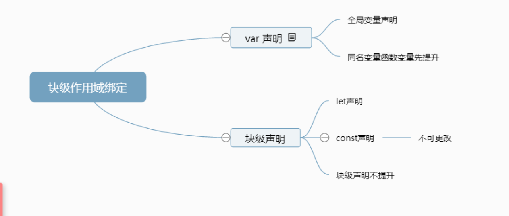
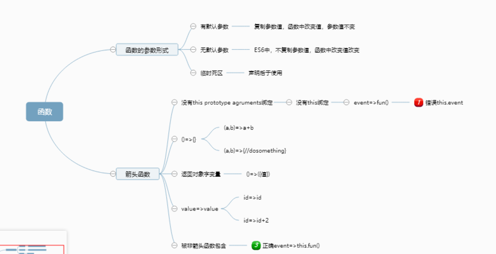
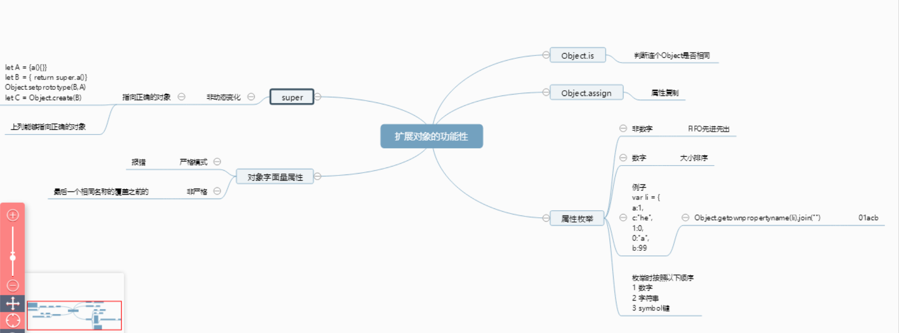
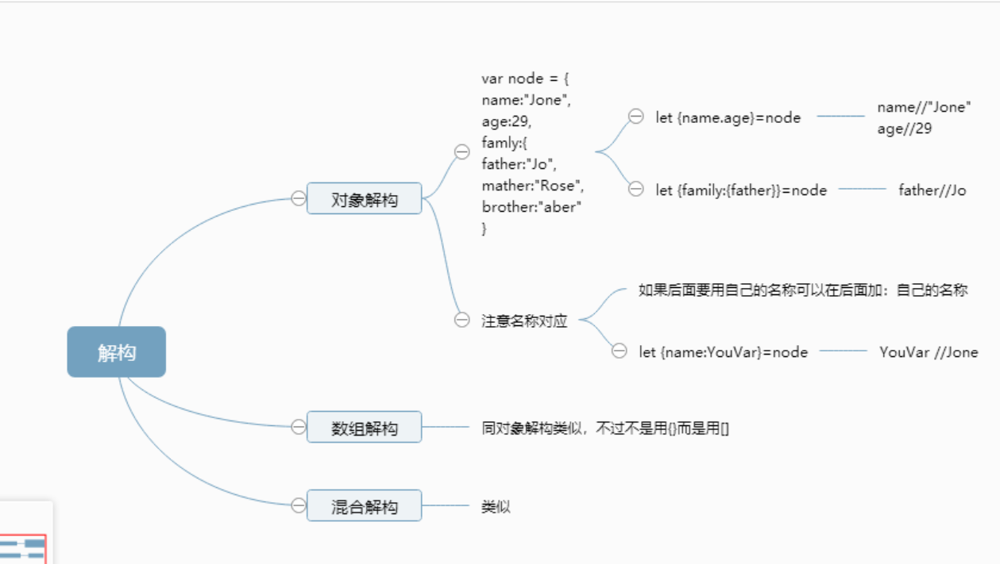
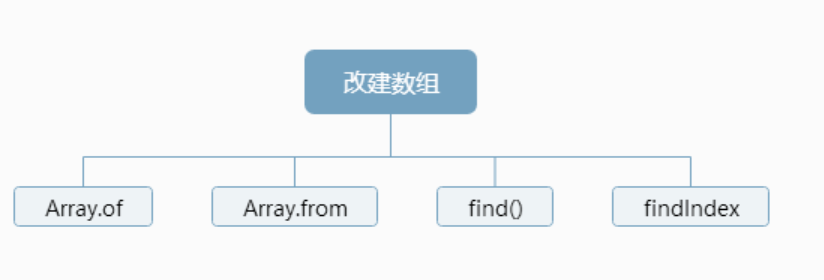
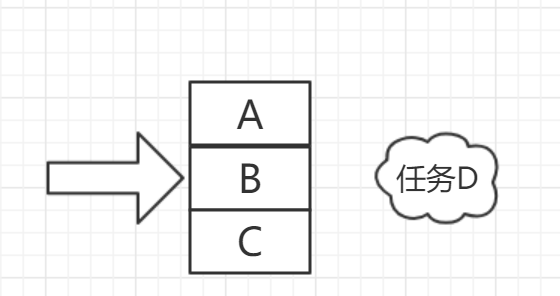
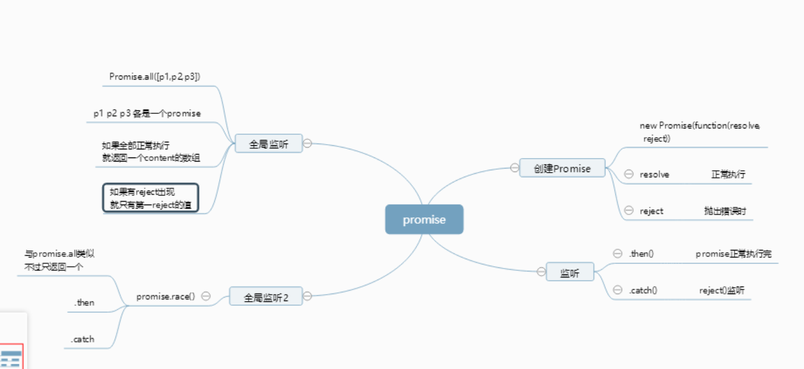

# 			深入理解ES6

1. 块级作用域绑定

   

2. 字符串和正则表达式

3. 函数

   

4. 扩展对象功能性

   

5. 解构

   

6. Symbol和Symbol属性

7. Set集合和Map集合

8. 迭代器和生成器

9. JavaScript中的类

10. 改进 的数组功能

   

11. promise与异步编程

+    事件模型

+    回调模式   回调地狱 真的是回调地狱 多个嵌套的回调函数，真是地狱

        

      javascript 引擎一个时间段只能执行一个代码块，当触发代码块B时，会向C后面添加一个任务D 任务D在代码块B中，所以是当调用B时，会先执行C再执行D，任务栈的先进先出。最后才添加的任务D

      回调地狱就是多个嵌套回调。

     Promise

     

1.  代理和反射API

    ​

2.  用模块封装代码