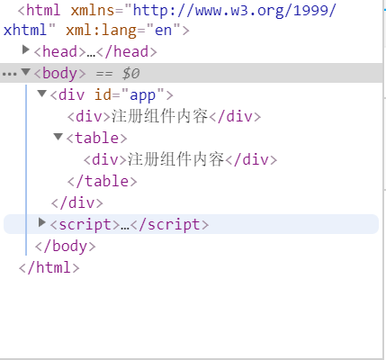

# 			VUE.js学习记录

+ 基础特性

  + 模板

  ```javascript
      <script type="x-template" id="tp1">'
          <div id=""wrapper>
              <div class="tp1">
                  <p>this is a tpl from script tag</p>
              </div>
              <div class="tp1">
                  <p>this is a tpl from script tag</p>
              </div>
          </div>
      </script>
  ```

我们通过` script`标签来进行模板定义 里面的模板必须有一个父标签，否则只会选取第一个标签中的

``````javascript
<SCRIPT type="text/javascript">
        var app = new Vue({
            el:'#app',//元素中的html将被换成#tp1中的 html 内容
            template:'#tp1',
        })
</SCRIPT>
``````

```javascript
<div id = "app">
    <p>123</p>
</div>
```
**最后我们在chrome中看到的文档树将是** 

```javascript
    <div id=""wrapper>
        <div class="tp1">
            <p>this is a tpl from script tag</p>
        </div>
        <div class="tp1">
            <p>this is a tpl from script tag</p>
        </div>
    </div> 
```
+ + 自定义组件

    ```javascript
    <script type="text/javascript">
        Vue.component("message",{
            props:['content','title'],//属性
            data:function () {//数据
                return {
                    name:'gavin'
                }
            },
            template: "<div><p>{{title}}</p>" +
                "<h1>{{content}}<small>{{name}}</small></h1>" +
                "</div>"
        })
        new Vue({ el: '#app' })//这一句必须要，是为了指明 vue的作用域
    </script>
    ```


+ + methods

  ```javascript
  var vm = new Vue({
      el: '#app',
      data:{a:1},
      methods:{"Ealter":function () {
              alert(this.a)
          }
      }
  })
  ```

  ​注意**是methods** 不是**method** 二者区别是**method**是网络请求的参数有` get post` 

+ + 数据绑定

  ```javascript
  <div id="app">
      <span v-bind:id = "'id-'+id">{{name}}</span>
      <p>{{index !== 0 ? names[0]:names[1]}}</p>
      <p v-for = "nam in names">{{nam}}</p>
      <ul v-for = "item in items">
          <li>{{item|json}}</li>
          <li>{{item.name}}<span>{{item.version}}</span></li>
      </ul>
      
  </div>

  <script type="text/javascript">
      var vm = new Vue({
          el:"#app",
          data:{
              name:"Vue",
              id:1,
              src:"../assets/img/a.png",
              index:0,
              names:["vue1","vue2"],
              items:[
                  {name:"css",version:"1.0"},
                  {name:"js",version:"3.0"},
                  {name:"html",version:"2.0"}
              ]
          }
      })
  </script>
  ```

**在绑定的时候用了v-bind: 就不能用{{}}来绑定了** 

+ 指令


+ + v-bind
  + v-model
  + v-if /v-else v-show
  + v-for//其中参数为(item,index)
  + v-on 事件监听
  + v-text v-html 是为了避免闪现
  + v-pre 跳过编译呈现原始的面目
  + v-once 只渲染一次
  + **自定义指令基础** 
  + + 指令注册：
    + + Vue.directive("名称",definition)
      + Vue.extend({dirctive:{“名称",definition}})//当前组件使用
    + 指令的定义对象
    + + bind 只被调用一次
      + update 在bind之后初始值为参数进行第一次调用，绑定值发生变化时调用
      + unbind 解绑时调用


+ 组件详解

+ + 组件与复用

    **注册方式** 全局注册 局部注册

    + 全局注册 Vue.component("my-component",{})
    + 局部注册 var vm = new Vue({ component:{}    })

    挂载到table 等元素的结果

    ```javascript
        <div id="app">
            <table>
                <tbody is="my-component"></tbody>
                <my-component></my-component>
            </table>
        </div>
    <script>
        Vue.component("myComponent",{
            template:"<div>注册组件内容</div>"
        })
        var vm = new Vue({
            el:'#app'
        })
    </script>
    ```

    **文档树** 

    

    **没有通过is挂载的table ul ol select 等自定义组件会被移除该标签外，提前** 

  + 使用props传递数据

    ```javascript
    <div id="app">
        <input type="number" v-model="counter">
        <my-component :count = "counter"></my-component>
        <button @click="MyAlert">点我</button>
    </div>
    <SCRIPT>
        Vue.component("myComponent",{
            props:["count"],
            template:'<div><button @click="count++">{{count}}</button></div>'

        })
        var vm =  new Vue({
            el:'#app',
            data:{
                counter:5
            },
            methods:{
                MyAlert:function () {
                    alert(this.counter)
                }

            }
        })
    </SCRIPT>
    ```

  ​     **数据绑定时是单向的，只能从父组件传导到子组件** 

  + 组件通信

  + + 自定义事件  v-on

    ```javascript
    <body>
        <DIV id="app">
            <p>{{total}}</p>
            <my-component @increase = "getTotal" @reduce = "getTotal"></my-component>
            <my-component v-model="total"></my-component>
        </DIV>
    <script>
        Vue.component("myComponent",{
            template:'<div><button @click = "Add">+1</button><button @click = "Reduce">-1</button>' +
                '<button @click = "modelAdd">modelADD</button></div>',
            data:function () {
                return {
                    count :0
                }
            },
            methods:{
                Add:function () {
                    this.count++;
                    this.$emit("increase",this.count)
                },
                Reduce:function () {
                    this.count--;
                    this.$emit("reduce",this.count)
                },
                modelAdd:function () {
                    this.count++;
                    this.$emit("input",this.count)
                }
            }
        });
        var vm =new Vue({
            el:'#app',
            data:{
                total:0
            },
            methods: {
                getTotal:function (data) {
                    this.total = data;
                }
            }
        })
    </script>
    ```


  + + 非父子组件通信

    ```javascript
    <body>
        <DIV id="app">
            <p>{{name}}</p>
            <my-component></my-component>
        </DIV>
    <script>
        var bus = new Vue();
        Vue.component("myComponent",{
            template:'<div><button @click="handleEvent">发送事件</button></div>',
            data:function () {
                return {
                    name:"Gavin"
                }
            },
            methods:{
                handleEvent:function () {
                    bus.$emit("bus-data",this.name)
                }
            }
        })
        var vm = new Vue({
            el:'#app',
            data:{
                name:""
            },
            mounted:function () {
                var _this = this;
                bus.$on("bus-data",function (data) {
                    _this.name = data;
                })
            }
        })
    </script>
    ```

  **通过一个bus 中央总线进行通信** 

  + 使用slot分发内容

  + + ```javascript
      <div id="app">
          <my :books = "books">
              <template slot = "book" scope = "props">
                  <li>{{props.bookName}}</li>
              </template>
          </my>
      </div>
      <script>
          Vue.component("my",{
              props:{
                  books: {
                      type:Array,
                      default:function () {
                          return []
                      }
                  }
              },
              template:'<ul><slot name = "book" v-for="book in books" :book-name="book.name"></slot></ul>'
          })
          var vm = new Vue({
              el: '#app',
              data:{
                  books:[
                      {name:"HTML"},
                      {name:"CSS"},
                      {name:"JAVASCRIPT"},
                  ]
              }
          })
      </script>
      ```


  + 组件高级用法

  + + 递归组件
    + 内联模板
    + 内联模板
    + 动态组件 

    ```javascript
    <div id="app">
        <component :is = "currentView"></component>
        <button @click = "change('A')">切换到A</button>
        <button @click = "change('B')">切换到B</button>
        <button @click = "change('C')">切换到C</button>
    </div>
    <script>

        var vm = new Vue({
            el: '#app',
            data:{
                currentView:'comA'
            },
            components:{
                comA:{
                    template:'<div>this is com A</div>'
                },
                comB:{
                    template: '<div>this is com B</div>'
                },
                comC:{
                    template:'<div>this is com C'
                }
            },
            methods:{
                change:function (data) {
                    this.currentView = 'com'+data;
                }
        }

        })
    </script>
    ```

    + 异步组件

  + 其他

    + $nextTick
    + X-template
    + 手动挂载实例

+ Vue.js常用插件

+ Vue.js工程实例

+ 状态管理：vuex

+ 跨平台开发:weex

+ Vue.js 2.0 新特性