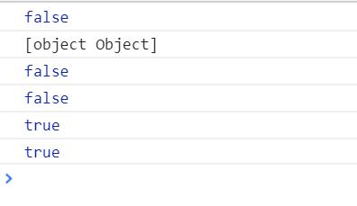

# 《你所不知道javaScript》  (中卷)


### 第三部分  类型和语法

1. 类型

   + null
   + undefined
   + string 
   + bool
   + number
   + object
   + symbol

   **除了对象外，其他的都称为基本类型** 

   symbol 是ES6中新增加的基本类型

   **在JS中变量是没有类型的，只有值才有。** 

2. 值

   + 数组
   + 类数组
   + + 需要通过一些数组工具函数转为为数组(indexOf(..),concat(...),forEach(...))


+  字符串 与字符串数组类似，一个是object 一个是string 基本类型，object 有reverse() 属性，string没有这个属性

+  数字

   + + .toFixed(显示位数)
     + .toPrecision
     + oxf3 0Xf3 s十六进制
     + 0363 0o363 0O363 八进制
     + 0b1101 0B1101 二进制
     + 二进制浮点数 并不是精确的

   + 特殊数值

   + + undefined 的值为undefined
     + null 的值为null

   + 特殊数字 NAN

   + + 数学运算中操作的有不是数字类型就会 返回NAN

       ```javascript
       var a = 2/"sd";//NAN
       console.log(typeof a === "number")//true
       ```


+ + NAN!=NAN 非自反的值
   + isNAN(data)来判断是不是NAN
+ 无穷数
   + + 运算结果溢出时，便会出现infinity 或者-infinity 但并不是 NAN


+    值和引用

     ```javascript
     var a = 2;
     var b = a;
     console.log(b)//2
     b = 4;
     console.log(a)//2
     var c = [1,2,3];
     var d = c;
     d.push(4);
     console.log(d)// 1 2 3 4
     console.log(c);//1 2 3 4
     console.log("---------");
     d = [5,6,7,8];
     d.push(9);
     console.log(d);//5 6 7 8 9
     console.log(c);//1 2 3 4
     ```

   从上面我们可以看到 b 是 a 的一个副本

   **对 c d的操作** 个人胡乱意淫的 

+ + 第一次d.push(4) ：此时d是引用c ，d相当于一个空白除了指向a 引用a ,但是a 中有值是一个数组对象，当d.push 时没有任何“容器”能够装值，没办法，只好求助指向的c 然后往c里进行push值
     + 下面对d进行赋值 d = [5,6,7,8]
     + 第二次d.push(9) 这一次 d中有数组obj 了，直接在obj中操作将值加到了d的数组值，而不是c。

1. 原生函数

   **常用原生函数** 

   + String()
   + Number()
   + Boolean
   + Array()
   + Object()
   + Function()
   + RegExp()
   + Date()
   + Error()
   + Symbol()----ES6中新加入的

   ```javascript
       var a = new Array(3);
       var b = [undefined,undefined,undefined];
       var c = Array.apply(null,{length:3})
       console.log(c)
       a.join("-");
       b.join("-");
       console.log(a)
       console.log(b)
       a.map(function (v,i) {
           return i;
       });
       b.map(function (v,i) {
           return i;
       })
       console.log(a)
       console.log(b)
   </script>
   ```

   **通过Array(3)创造的 数组中不存在任何单元** 

   **而通过b c方法创造的 是有单元的里面有未申明的undefined** 

2. 强制类型转换

   + **ToString** 

     ```javascript
     var a = 123;
     var c = a + "";
     var e = String(a)//显式
     d = 123;
     d.toString()//隐式
     console.log(typeof d.toString(),typeof d);// string number
     ```

   最有一个可以看出，使用toString 并没有改变原值

   + **JSON字符串化** 

     **工具函数 JSON.stringfy()** //前提是安全的json 值，能够有效的呈现json格式的值


+ **ToNumber** 

     + praseInt()
       **解析为第一次出现的数字字符**  仅仅针对string类型


     + Number(a)

     ```javascript
     var  a ="42";
     var c = [4,2];
     console.log(Number(a))//42
     console.log(Number(c))//NAN
     console.log(Number(""))//0
     console.log(Number([]))//NAN
     console.log(Number(true))//1
     console.log(Number(false))//0
     console.log(Number(Object))//NAN
     console.log(Number(Symbol))//NAN
     console.log(Number(null))//0
     console.log(Number(undefined))//NAN
     ```

   Number()只能将带纯数字的string类型转化为number 和bool型才能转化

   #### 大坑开始 

+    **奇特的~运算符** (注意使用的情况ToInt32(32位))

     ~会将-1转化为假 0 其他情况一律为真值1 

     ```javascript
     var a = -42.95;//-42
     console.log(~~a)
     var a = 42.95;//42
     console.log(~~a)
     ```

     **用~~取整只会截取整数部分** 

+    **显示解析数字字符串** 

     ```javascript
      console.log(parseInt("a",20))//10
      console.log(parseInt("b",20))//11
      console.log(parseInt("c",20))//12
      console.log(parseInt("dx",20))//13
     ```

      第二参数为以多少进制去处理这个前面的字符串，默认是10进制，当字符串中字母大于有效字母时就截止。**如果遇到的第一个字符是x或X按照16进制转化 如果是0八进制。第一字母必须是0时才成立

     ```javascript
      console.log(parseInt("0x10"))
     ```

      **显示转换为布尔值** 

     ```javascript
      var a = "";
      var b =false;
      var c = null;
      var d = undefined;
      var e = 0;
      console.log(Boolean(a))//false
      console.log(Boolean(b))//false
      console.log(Boolean(c))//false
      console.log(Boolean(d))//false
      console.log(Boolean(e))//false
     ```

      上面几个均为假值除了这几个其他的均为真，只要Boolean()中的对象不是上面几个，注意

      ` var a= "false";var c = "null";var d ="''" ` 这种情况，这是string类型。用Boolean转换时是为真。

     ```javascript
      console.log(!a)//true
      console.log(!b)//true
      console.log(!c)//true
     ```

      也可以用!来进行转化

      **数字转化** 

     ```javascript
      var c = [4];
      var d = [2]
      console.log(c-d)//2
      var a = [3,4];
      var b = [1,2]
      console.log(a-b)//NAN
      var e = [3,4];
      var f = [1,2]
      console.log(e+f)//3,41,2 string 
      console.log(c+d)//42 string
      console.log(Number(c)+Number(d)) //6
     ```

      只有执行减法时才会自动转化为数字，不然转为string 进行相加

      **typeof e+f** 执行顺序为 先执行typeof e 然后再加上f

      **||和&&** 

      在js中这并不是返回bool值 而是返回其中的一个的返回值。

     ```javascript
      var a = 42;
      var b ="abc";
      var c =null;
      a||b;//42 第一个就是真 所以直接返回第一个不是第二个
      a&&b;//先判断a 为真 判断第二个 b为真 返回b的值 abc
      c||b;//先判断c 为假 判断第二个 b 为真，返回 b的值 abc
      c&&b;//c为假 结束 返回c 的值null
     ```

      **宽松相等和严格相等** 

      == 宽松相等 不考虑 强制类型转换

      ===严格相等，考虑强制转换

      **null 和undefined 比较** 

      不想写了。

      **看一个超级有趣的例子** 

     ```javascript
      var a = {b:42}
      var b = {b:43}
      console.log(a>b)//false
      console.log(String(a))//[object object]
      console.log(a==b)//false
      console.log(a<b)//false
      console.log(a>=b)//true
      console.log(a<=b)//true
     ```

      **话不多说看结果** 

      
      **想多了，简单一想就可以了 除非b引用a 否则a b永不可能为同一个对象，所以我们对对象进行比较的时候无论是，大于小于或者等于永远是false。肯定的** 

     为什么>=或者<= 又是正确的呢？

     **(a<=b)在js进行编译执行的时候是(!(a>b))所以返回为true**  ​


### 第四部分 异步与性能

1. 异步：现在与将来
2. 回调
3. promise
4. 生成器
5. 程序性能
6. 性能测试与调优